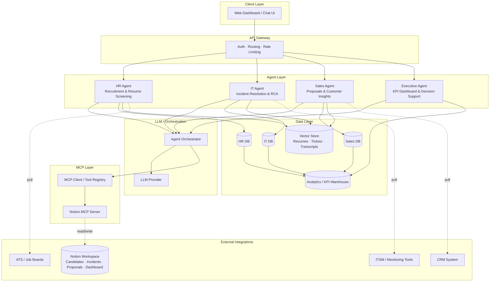
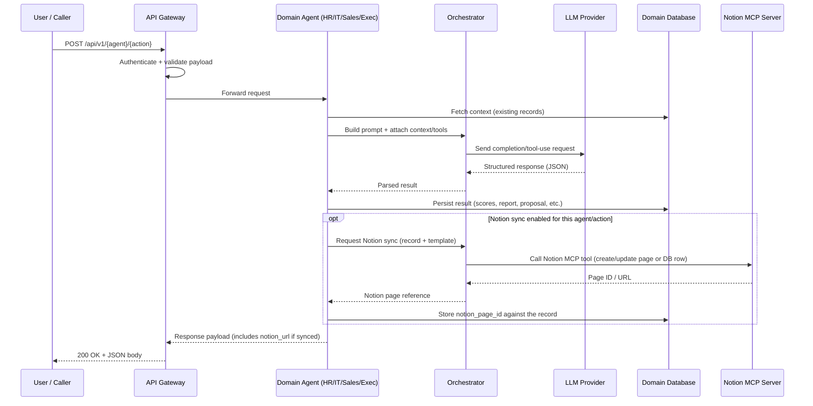
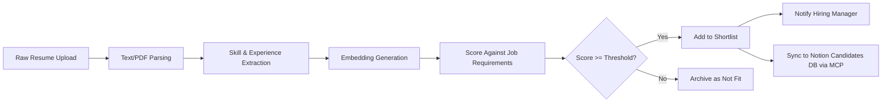
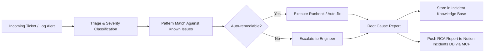
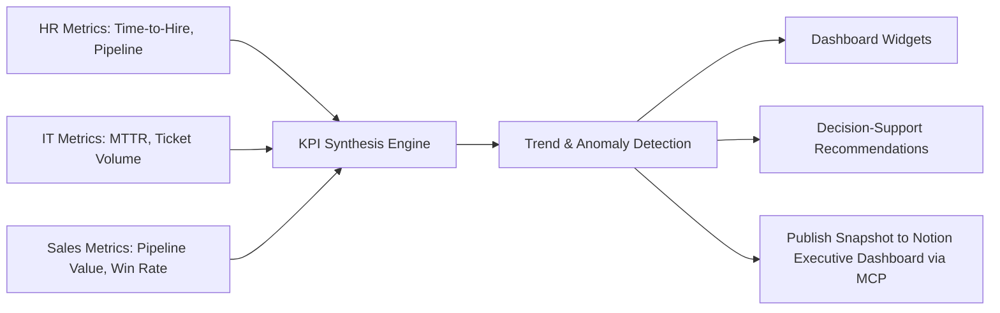
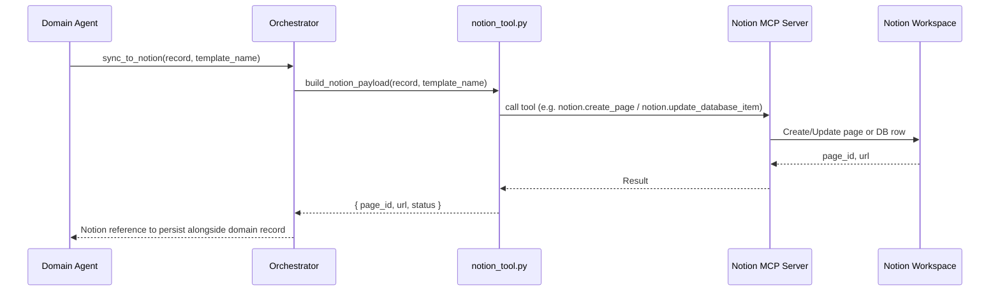
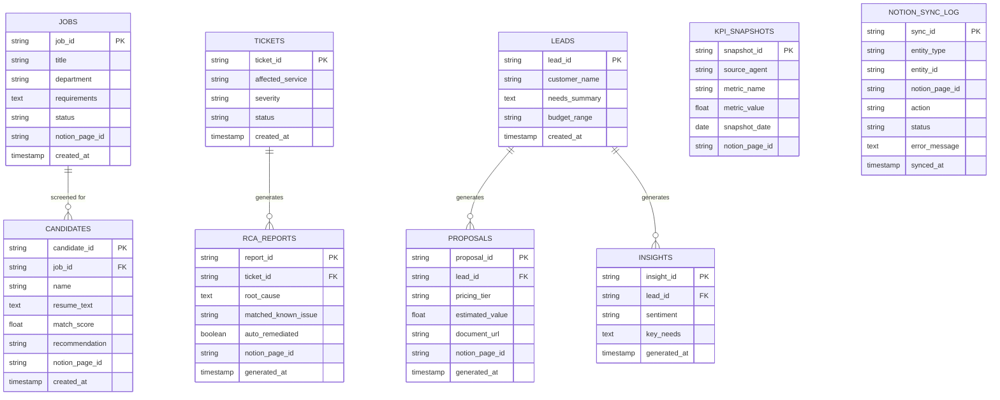

# Enterprise Multi-Agent System

A modular, multi-agent platform where specialized AI agents automate core business functions — Human Resources, IT Operations, Sales, and Executive Reporting — and feed their outputs into a shared data layer that powers cross-functional insights. All agents route through a shared orchestrator that now also has **MCP (Model Context Protocol) access to Notion**, letting agents read from and write to Notion workspaces (candidate trackers, incident logs, proposal docs, executive dashboards) as a first-class tool, not just an internal DB.

---

## 1. Project Overview

| Agent | Core Responsibilities | Primary Consumers | Notion MCP Usage |
|---|---|---|---|
| **HR Agent** | Recruitment, Resume Screening | Hiring Managers, Executive Agent | Pushes job requisitions to a Notion **"Job Descriptions"** database and shortlisted candidates + score breakdowns to a Notion "Candidates" database |
| **IT Agent** | Incident Resolution, Root Cause Analysis | IT Ops Team, Executive Agent | Writes RCA reports to a Notion "Incidents" database; can read runbook pages |
| **Sales Agent** | Proposal Generation, Customer Insights | Sales Reps, Executive Agent | Publishes generated proposals as Notion pages; logs customer insights |
| **Executive Agent** | KPI Dashboard, Decision Support | Leadership | Syncs KPI snapshots to a Notion "Executive Dashboard" page; reads strategic notes |

Each domain agent is autonomous — it owns its data pipeline, its own database tables, and exposes a REST API. The **Executive Agent** does not own primary data; it aggregates outputs from the other three agents (via their APIs or a shared analytics store) to generate cross-functional KPIs and decision-support recommendations. **Notion is treated as a downstream/collaborative surface** — agents write human-readable summaries there for non-technical stakeholders, while the relational DB remains the system of record.

---

## 2. Architecture Diagram



**Key design principles**
- **Loose coupling:** Each agent is independently deployable with its own database schema and API surface.
- **Shared orchestration:** All agents route LLM calls through a common orchestrator so prompts, model versions, and tool-use policies stay consistent.
- **Single source of truth for KPIs:** The Executive Agent never writes to another agent's database — it only reads aggregated/derived data from the Analytics Warehouse.
- **Vector store reuse:** Resumes, ticket logs, and CRM transcripts are embedded once and reused for both search (screening/triage) and semantic analysis (skills matching, RCA similarity, sentiment).
- **Notion as a collaboration surface, not a system of record:** The relational DB (Section 7) stays authoritative. Notion MCP writes are best-effort, idempotent syncs keyed by the same domain IDs (`candidate_id`, `ticket_id`, `proposal_id`, `snapshot_id`) so a page can always be re-synced or reconciled without creating duplicates.
- **MCP as a shared tool, not per-agent glue code:** The Notion MCP server is registered once in the orchestrator's tool registry (`orchestrator/tools/notion_tool.py`) and exposed to any agent that needs it, the same way `embedding_tool` and `scoring_tool` are shared today.

---

## 3. How Requests Move Through The System

### 3.1 General request lifecycle (applies to all agents)



The Notion sync step is **opt-in per action** (controlled by a `sync_to_notion: true/false` flag or agent-level config) and always runs **after** the domain DB write succeeds, so the relational DB is never left inconsistent if the Notion MCP call fails. Failures are logged and retried by a background job rather than blocking the API response.

### 3.2 Example: Resume Screening flow (HR Agent)



### 3.3 Example: Incident → RCA flow (IT Agent)



### 3.4 Example: Executive aggregation flow



### 3.5 New: Notion MCP sync flow (shared across agents)



**Idempotency rule:** every sync call looks up `notion_page_id` on the domain record first. If present, it issues an *update*; if absent, it issues a *create* and stores the returned `page_id`. This prevents duplicate pages when a record is re-processed (e.g., a resume re-screened, an RCA report regenerated).

### 3.6 Confirmed Notion schema: HR Agent → "Job Descriptions" database

The HR Agent's `JOBS` table is already synced against a live Notion database. This is the real, provisioned schema (not a placeholder) — `orchestrator/tools/notion_tool.py` and `agents/hr_agent/notion_templates/job_description_page.md` must map to these exact property names and types.

| Notion Property | Type | Maps From (`JOBS` table) | Notes |
|---|---|---|---|
| `job_id` | Title (text) | `job_id` | Primary key / page title, e.g. `DE-2026-001` |
| `job_title` | Text | `title` | e.g. "Data Engineer" |
| `department` | Select | `department` | e.g. "Engineering" — must match an existing Select option or be created via the MCP tool |
| `full_jd_text` | Text | `requirements` | Full job description body (role, responsibilities, requirements) |
| `created_at` | Date | `created_at` | Date only, no time component in the current view |

There's also an `OPEN`/status tag visible in the Notion table (next to `job_id`) — this is a status property (e.g. `status`: Open/Closed/On Hold) not currently represented in `JOBS`. Recommend adding a `status` column to `JOBS` (Section 7) so it can round-trip both ways instead of being Notion-only.

**Sync direction:** job requisitions can be created from either side —
- **App → Notion:** `POST /api/v1/hr/jobs` creates the row in `JOBS`, then syncs to Notion via `notion_tool.py` (create if no `notion_page_id`, else update).
- **Notion → App (optional, future):** a polling or webhook-based pull from the Notion MCP server could ingest new/edited rows in "Job Descriptions" back into `JOBS`, letting recruiters author JDs directly in Notion. Not yet implemented — see Next Steps.

---

## 4. Project Structure

```
enterprise-agent-system/
├── README.md
├── docker-compose.yml
├── .env.example                  # includes NOTION_MCP_URL / NOTION_INTEGRATION_TOKEN
│
├── gateway/
│   ├── main.py                  # API gateway entrypoint, auth, routing
│   ├── middleware/
│   │   ├── auth.py
│   │   └── rate_limit.py
│   └── routes/
│       ├── hr_routes.py
│       ├── it_routes.py
│       ├── sales_routes.py
│       └── executive_routes.py
│
├── agents/
│   ├── hr_agent/
│   │   ├── __init__.py
│   │   ├── service.py            # Recruitment + Resume Screening logic
│   │   ├── prompts/
│   │   │   ├── resume_screening.md
│   │   │   └── job_matching.md
│   │   ├── notion_templates/
│   │   │   ├── job_description_page.md  # maps JOBS fields -> "Job Descriptions" Notion DB (job_id, job_title, department, full_jd_text, created_at)
│   │   │   └── candidate_page.md # maps CANDIDATES fields -> Notion DB properties
│   │   ├── models.py              # Pydantic/ORM schemas
│   │   └── db.py
│   │
│   ├── it_agent/
│   │   ├── __init__.py
│   │   ├── service.py            # Incident Resolution + RCA logic
│   │   ├── prompts/
│   │   │   ├── triage.md
│   │   │   └── root_cause_analysis.md
│   │   ├── notion_templates/
│   │   │   └── rca_report.md     # maps RCA_REPORTS fields -> Notion DB properties
│   │   ├── models.py
│   │   └── db.py
│   │
│   ├── sales_agent/
│   │   ├── __init__.py
│   │   ├── service.py            # Proposal Generation + Customer Insights
│   │   ├── prompts/
│   │   │   ├── proposal_draft.md
│   │   │   └── sentiment_needs_analysis.md
│   │   ├── notion_templates/
│   │   │   └── proposal_page.md  # maps PROPOSALS fields -> Notion page blocks
│   │   ├── models.py
│   │   └── db.py
│   │
│   └── executive_agent/
│       ├── __init__.py
│       ├── service.py            # KPI aggregation + Decision Support
│       ├── prompts/
│       │   └── strategic_summary.md
│       ├── notion_templates/
│       │   └── dashboard_snapshot.md  # maps KPI_SNAPSHOTS -> Notion dashboard page
│       ├── models.py
│       └── db.py
│
├── orchestrator/
│   ├── orchestrator.py           # Shared LLM call handler, tool registry
│   ├── tools/
│   │   ├── embedding_tool.py
│   │   ├── scoring_tool.py
│   │   └── notion_tool.py        # NEW: wraps Notion MCP client, builds payloads, idempotency logic
│   └── llm_client.py
│
├── mcp/
│   ├── notion_mcp_client.py      # NEW: thin client around the Notion MCP server connection
│   └── config.py                 # NEW: MCP server URL, auth, database/page ID mappings
│
├── shared/
│   ├── vector_store/
│   │   └── client.py             # Wraps vector DB (e.g., pgvector/Pinecone)
│   ├── analytics/
│   │   └── warehouse.py          # ETL into KPI warehouse
│   └── utils/
│       ├── parsing.py            # Resume/log/document parsing helpers
│       └── logging.py
│
├── db/
│   ├── migrations/
│   └── schema.sql                # Full DB schema (see Section 7)
│
└── tests/
    ├── hr_agent/
    ├── it_agent/
    ├── sales_agent/
    ├── executive_agent/
    └── mcp/
        └── test_notion_sync.py   # NEW: idempotency + retry tests for Notion sync
```

---

## 5. API Endpoints

All endpoints are versioned under `/api/v1` and routed through the API Gateway. Each domain's mutating endpoints now accept an optional `sync_to_notion` flag, and each domain exposes a dedicated sync endpoint for manual/backfill syncs.

### 5.1 HR Agent

| Method | Endpoint | Description |
|---|---|---|
| `POST` | `/api/v1/hr/jobs` | Create a new job requisition (`sync_to_notion` optional — writes to the "Job Descriptions" Notion DB) |
| `POST` | `/api/v1/hr/resumes/upload` | Upload and parse a raw resume |
| `POST` | `/api/v1/hr/resumes/screen` | Screen a resume against a job's requirements (`sync_to_notion` optional) |
| `GET` | `/api/v1/hr/candidates/shortlist?job_id=` | Retrieve ranked shortlist for a job |
| `GET` | `/api/v1/hr/candidates/{candidate_id}` | Get candidate detail + score breakdown |
| `POST` | `/api/v1/hr/candidates/{candidate_id}/sync-notion` | **NEW:** Force (re)sync a candidate to the Notion Candidates DB |
| `POST` | `/api/v1/hr/jobs/{job_id}/sync-notion` | **NEW:** Force (re)sync a job requisition to the Notion "Job Descriptions" DB |

### 5.2 IT Agent

| Method | Endpoint | Description |
|---|---|---|
| `POST` | `/api/v1/it/tickets` | Submit a new incident/ticket |
| `POST` | `/api/v1/it/tickets/{ticket_id}/triage` | Run triage/classification on a ticket |
| `POST` | `/api/v1/it/tickets/{ticket_id}/rca` | Generate root cause analysis report (`sync_to_notion` optional) |
| `GET` | `/api/v1/it/tickets/{ticket_id}` | Get ticket status and resolution history |
| `GET` | `/api/v1/it/incidents/known-issues` | List matched known-issue patterns |
| `POST` | `/api/v1/it/tickets/{ticket_id}/sync-notion` | **NEW:** Force (re)sync an RCA report to the Notion Incidents DB |

### 5.3 Sales Agent

| Method | Endpoint | Description |
|---|---|---|
| `POST` | `/api/v1/sales/leads` | Ingest a new lead/CRM record |
| `POST` | `/api/v1/sales/insights/{lead_id}` | Generate customer insight (sentiment/needs) |
| `POST` | `/api/v1/sales/proposals/generate` | Generate a personalized proposal (`sync_to_notion` optional) |
| `GET` | `/api/v1/sales/proposals/{proposal_id}` | Retrieve a generated proposal |
| `POST` | `/api/v1/sales/proposals/{proposal_id}/sync-notion` | **NEW:** Force (re)publish a proposal as a Notion page |

### 5.4 Executive Agent

| Method | Endpoint | Description |
|---|---|---|
| `GET` | `/api/v1/executive/kpis?range=` | Retrieve aggregated KPI dashboard data |
| `GET` | `/api/v1/executive/trends?metric=` | Get trend/time-series data for a metric |
| `POST` | `/api/v1/executive/decision-support` | Get a recommendation for a strategic question |
| `POST` | `/api/v1/executive/kpis/sync-notion` | **NEW:** Push the latest KPI snapshot to the Notion Executive Dashboard page |

---

## 6. Examples

### 6.1 HR Agent — Create Job Requisition (with Notion sync)

**Request**
```http
POST /api/v1/hr/jobs
Content-Type: application/json
```
```json
{
  "job_id": "DE-2026-001",
  "title": "Data Engineer",
  "department": "Engineering",
  "requirements": "Role: Data Engineer\n\nResponsibilities:\n- Design, build, and maintain data pipelines...",
  "status": "Open",
  "sync_to_notion": true
}
```

**Response**
```json
{
  "job_id": "DE-2026-001",
  "title": "Data Engineer",
  "department": "Engineering",
  "status": "Open",
  "notion": {
    "page_id": "3f2a1b9c-...",
    "url": "https://notion.so/DE-2026-001-Data-Engineer-3f2a1b9c",
    "database": "Job Descriptions"
  },
  "created_at": "2026-07-11T00:00:00Z"
}
```

This maps directly onto the confirmed Notion columns: `job_id` → Title, `title` → `job_title`, `department` → `department` (Select), `requirements` → `full_jd_text`, `created_at` → `created_at`.

### 6.2 HR Agent — Resume Screening (with Notion sync)

**Request**
```http
POST /api/v1/hr/resumes/screen
Content-Type: application/json
```
```json
{
  "job_id": "job_2031",
  "candidate": {
    "name": "Priya Sharma",
    "resume_text": "5 years experience in backend development with Python, FastAPI, PostgreSQL...",
    "resume_file_url": "s3://resumes/priya_sharma.pdf"
  },
  "sync_to_notion": true
}
```

**Response**
```json
{
  "candidate_id": "cand_8841",
  "job_id": "job_2031",
  "match_score": 87.5,
  "skill_matches": ["Python", "FastAPI", "PostgreSQL", "REST APIs"],
  "missing_skills": ["Kubernetes"],
  "recommendation": "shortlist",
  "summary": "Strong backend engineering background with 5 years relevant experience; minor gap in container orchestration skills.",
  "notion": {
    "page_id": "a1b2c3d4-...",
    "url": "https://notion.so/Priya-Sharma-cand_8841-a1b2c3d4"
  },
  "created_at": "2026-07-10T09:12:00Z"
}
```

### 6.3 IT Agent — Root Cause Analysis (with Notion sync)

**Request**
```http
POST /api/v1/it/tickets/tkt_5521/rca
Content-Type: application/json
```
```json
{
  "ticket_id": "tkt_5521",
  "logs": [
    "2026-07-10T02:14:00Z ERROR db_connection_pool: timeout after 30s",
    "2026-07-10T02:14:05Z WARN api_gateway: 503 upstream unavailable"
  ],
  "affected_service": "checkout-service",
  "sync_to_notion": true
}
```

**Response**
```json
{
  "ticket_id": "tkt_5521",
  "severity": "high",
  "root_cause": "Database connection pool exhaustion caused by an unclosed transaction leak in the checkout-service payment handler.",
  "matched_known_issue": "KI-0092",
  "recommended_fix": "Apply patch to close DB sessions in payment_handler.py; increase pool size as a short-term mitigation.",
  "auto_remediated": false,
  "escalated_to": "backend-oncall",
  "notion": {
    "page_id": "e5f6a7b8-...",
    "url": "https://notion.so/tkt_5521-RCA-e5f6a7b8"
  },
  "generated_at": "2026-07-10T02:20:00Z"
}
```

### 6.4 Sales Agent — Proposal Generation (with Notion sync)

**Request**
```http
POST /api/v1/sales/proposals/generate
Content-Type: application/json
```
```json
{
  "lead_id": "lead_3390",
  "customer_name": "Northwind Traders",
  "needs_summary": "Looking to automate inventory reporting across 12 warehouses.",
  "budget_range": "50000-75000",
  "product_line": "Enterprise Analytics Suite",
  "sync_to_notion": true
}
```

**Response**
```json
{
  "proposal_id": "prop_1187",
  "lead_id": "lead_3390",
  "pricing_tier": "Enterprise",
  "estimated_value": 68000,
  "proposal_document_url": "s3://proposals/prop_1187.pdf",
  "key_points": [
    "Automated multi-warehouse inventory dashboards",
    "Real-time anomaly alerts",
    "12-week implementation timeline"
  ],
  "notion": {
    "page_id": "9c8d7e6f-...",
    "url": "https://notion.so/Northwind-Traders-Proposal-9c8d7e6f"
  },
  "generated_at": "2026-07-10T10:05:00Z"
}
```

### 6.5 Executive Agent — KPI Dashboard (with Notion sync)

**Request**
```http
GET /api/v1/executive/kpis?range=last_30_days
```

**Response**
```json
{
  "range": "last_30_days",
  "hr": {
    "open_positions": 14,
    "avg_time_to_hire_days": 21,
    "shortlist_rate": 0.34
  },
  "it": {
    "tickets_resolved": 402,
    "avg_mttr_minutes": 47,
    "auto_remediation_rate": 0.28
  },
  "sales": {
    "proposals_generated": 56,
    "pipeline_value": 1240000,
    "win_rate": 0.31
  },
  "notion_dashboard_url": "https://notion.so/Executive-Dashboard-last-30-days",
  "generated_at": "2026-07-10T11:00:00Z"
}
```

### 6.6 Manual Notion sync (any agent)

**Request**
```http
POST /api/v1/it/tickets/tkt_5521/sync-notion
```

**Response**
```json
{
  "ticket_id": "tkt_5521",
  "notion_page_id": "e5f6a7b8-...",
  "action": "updated",
  "url": "https://notion.so/tkt_5521-RCA-e5f6a7b8",
  "synced_at": "2026-07-10T12:30:00Z"
}
```

---

## 7. Database Structure

Each domain agent owns its own schema; the Executive Agent reads from a derived **Analytics Warehouse** rather than the source tables directly. Notion is not a system of record — every synced entity carries a `notion_page_id` on its own table so the relational DB stays authoritative and re-syncs stay idempotent.



**Notes**
- `KPI_SNAPSHOTS` is populated by a periodic ETL job that reads from `CANDIDATES`, `TICKETS`, `RCA_REPORTS`, `LEADS`, and `PROPOSALS`, aggregating them into standard metrics (time-to-hire, MTTR, win rate, etc.).
- The Executive Agent's `/kpis` and `/trends` endpoints query `KPI_SNAPSHOTS` exclusively — it never has write access to other agents' tables, preserving domain ownership boundaries.
- Vector embeddings (resumes, ticket logs, CRM transcripts) are stored separately in a vector store, keyed by the same IDs (`candidate_id`, `ticket_id`, `lead_id`) for cross-referencing.
- **`notion_page_id`** columns (added to `JOBS`, `CANDIDATES`, `RCA_REPORTS`, `PROPOSALS`, `KPI_SNAPSHOTS`) let `notion_tool.py` decide create-vs-update on every sync call.
- **`JOBS.status`** (new) mirrors the `OPEN` status tag already visible in the live Notion "Job Descriptions" table, so status changes can eventually round-trip in either direction (see Section 3.6).
- **`NOTION_SYNC_LOG`** (new) is an audit/retry table: every MCP sync attempt (success or failure) is recorded here so failed syncs can be retried by a background worker without re-triggering the LLM call.

---

## 8. Tech Stack Recommendation

| Layer | Suggested Technology |
|---|---|
| API Gateway | FastAPI / Express.js + JWT auth |
| Agent Services | Python (FastAPI) or Node.js microservices |
| LLM Orchestration | Anthropic API (Claude) with tool-use for structured outputs |
| MCP Integration | Notion MCP Server, registered as a shared tool in the orchestrator's tool registry |
| Relational DB | PostgreSQL (one schema per agent) |
| Vector Store | pgvector or a managed vector DB |
| Analytics Warehouse | PostgreSQL materialized views or a lightweight OLAP store |
| Collaboration Surface | Notion (Candidates, Incidents, Proposals, and Executive Dashboard workspaces), synced via MCP |
| Messaging (optional) | Kafka/RabbitMQ for async ticket/lead ingestion, and for retrying failed Notion syncs |
| Deployment | Docker Compose (dev) → Kubernetes (prod) |

---

## 9. Next Steps

1. Scaffold the four agent services with the folder structure above.
2. Define Pydantic/ORM models matching the schema in Section 7, including the new `notion_page_id` columns and `NOTION_SYNC_LOG` table.
3. Implement the orchestrator with a shared prompt-template system per agent.
4. Wire the ETL job that populates `KPI_SNAPSHOTS` for the Executive Agent.
5. Add authentication and role-based access control at the gateway level.
6. **Provision the Notion MCP server:** create a Notion internal integration, generate an integration token, and set `NOTION_MCP_URL` / `NOTION_INTEGRATION_TOKEN` in `.env`.
7. **Create the remaining Notion workspace structure:** the "Job Descriptions" database already exists (schema confirmed in Section 3.6) — still need a "Candidates" database, an "Incidents" database, a "Proposals" database/page, and an "Executive Dashboard" page. Record all database/page IDs in `mcp/config.py`.
8. **Implement `orchestrator/tools/notion_tool.py`:** wraps the MCP client, applies each agent's `notion_templates/*.md` mapping (start with `job_description_page.md` against the live schema), and enforces the create-vs-update idempotency rule against `notion_page_id`.
9. **Add `status` to the `JOBS` table** (Section 7) to mirror the `OPEN`/status tag already present in the Notion "Job Descriptions" view.
10. **Add the sync-notion endpoints and `sync_to_notion` flag** to each agent's routes, plus a background retry worker driven by `NOTION_SYNC_LOG` for failed syncs.
11. Write integration tests simulating the end-to-end flows in Section 3, including `tests/mcp/test_notion_sync.py` for create/update/retry behavior.
